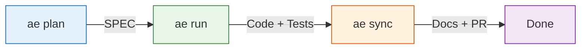
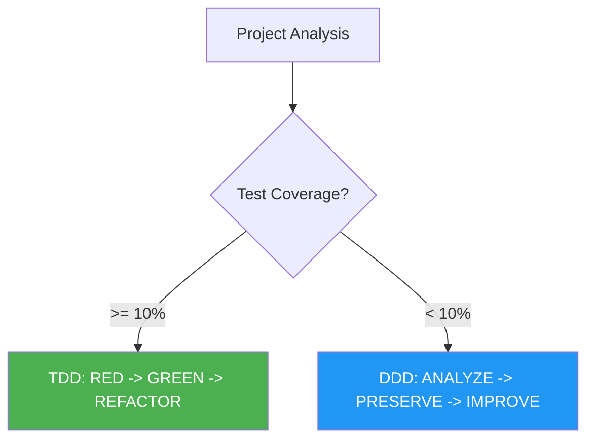

<h1 align="center">AE-ADK</h1>

<p align="center">
  <strong>AngelEyes Agentic Development Kit for Claude Code</strong>
</p>

<p align="center">
  <a href="https://github.com/AngeleyesTrue/ae-adk/actions/workflows/ci.yml"></a>
  <a href="https://github.com/AngeleyesTrue/ae-adk/releases"></a>
  <a href="https://go.dev/"></a>
  <a href="./LICENSE"></a>
</p>

---

AE-ADK is a personal fork of [moai-adk](https://github.com/modu-ai/moai-adk), optimized for single-developer workflows. It extends Claude Code with AI agent orchestration, automated quality gates, and a SPEC-driven development pipeline.

Built as a single Go binary -- zero dependencies, instant startup on Windows, macOS, and Linux.

## Features

- **SPEC-Driven Workflow** -- Plan requirements, implement with TDD/DDD, sync documentation in one pipeline
- **AI Agent Orchestration** -- Specialized agents for backend, frontend, security, testing, and more
- **Automated Quality Gates** -- TRUST 5 framework enforces test coverage, security, and code style
- **Cross-Platform** -- `ae win` / `ae mac` for seamless platform switching with PATH auto-reconfiguration
- **Self-Updating** -- Built-in binary update with checksum verification and automatic rollback
- **Hook System** -- Pre/post tool hooks for formatting, linting, and security scanning

## Installation

### macOS / Linux

```bash
curl -fsSL https://raw.githubusercontent.com/AngeleyesTrue/ae-adk/main/install.sh | bash
```

### Windows (PowerShell)

```powershell
irm https://raw.githubusercontent.com/AngeleyesTrue/ae-adk/main/install.ps1 | iex
```

### Build from Source

```bash
git clone https://github.com/AngeleyesTrue/ae-adk.git
cd ae-adk && make build
```

Prebuilt binaries are available on the [Releases](https://github.com/AngeleyesTrue/ae-adk/releases) page.

## Quick Start

```bash
# 1. Initialize a project
ae init my-project

# 2. Start developing with Claude Code
/ae plan "Add user authentication"     # Create SPEC document
/ae run SPEC-AUTH-001                   # Implement with TDD/DDD
/ae sync SPEC-AUTH-001                  # Generate docs & create PR
```

### Development Pipeline



## CLI Reference

### Terminal Commands

| Command | Description |
|---------|-------------|
| `ae init` | Interactive project setup with language/framework auto-detection |
| `ae update` | Update binary with rollback support |
| `ae doctor` | System health diagnosis |
| `ae win` | Switch to Windows platform (PATH + diagnostics) |
| `ae mac` | Switch to macOS platform (PATH + diagnostics) |
| `ae worktree` | Git worktree management for parallel development |
| `ae version` | Display version, commit, and build date |

### Claude Code Commands

| Command | Purpose |
|---------|---------|
| `/ae plan "description"` | Create SPEC document (EARS format) |
| `/ae run SPEC-XXX` | TDD/DDD implementation |
| `/ae sync` | Documentation sync + PR creation |
| `/ae fix` | Auto-fix LSP errors and lint issues |
| `/ae loop` | Iterative fix until all errors resolved |
| `/ae review` | Multi-perspective code review |
| `/ae coverage` | Test coverage analysis + gap filling |
| `/ae mx` | Add @MX code annotations for AI context |
| `/ae clean` | Dead code identification and removal |

## Development Methodology

AE-ADK automatically selects the optimal methodology based on your project state:



| Methodology | Cycle | Best For |
|-------------|-------|----------|
| **TDD** (default) | Write test -> Implement -> Refactor | New projects, features |
| **DDD** | Analyze code -> Add tests -> Improve | Legacy code with low coverage |

## Quality Framework (TRUST 5)

Every code change is validated against five criteria:

| Gate | Meaning | Threshold |
|------|---------|-----------|
| **T**ested | Test coverage | 85%+ |
| **R**eadable | Code clarity | 0 lint errors |
| **U**nified | Style consistency | Consistent formatting |
| **S**ecured | Security | OWASP compliance |
| **T**rackable | Traceability | Conventional commits |

## Build & Test

```bash
make build          # Build binary
make test           # Run tests
make lint           # Run linter
make coverage       # Generate coverage report
```

### Test Results

```
$ go test ./...
ok   github.com/AngeleyesTrue/ae-adk/internal/cli         4.2s
ok   github.com/AngeleyesTrue/ae-adk/internal/hook         5.5s
ok   github.com/AngeleyesTrue/ae-adk/internal/platform     2.1s   coverage: 97.8%
ok   github.com/AngeleyesTrue/ae-adk/internal/update       4.1s
ok   github.com/AngeleyesTrue/ae-adk/internal/template     2.0s
ok   github.com/AngeleyesTrue/ae-adk/pkg/version           1.2s
...
ok   34/35 packages passed
```

### Cross-Platform Builds

```
$ goreleaser release --clean
  -> windows/amd64    ae-adk_1.0.1_windows_amd64.zip
  -> windows/arm64    ae-adk_1.0.1_windows_arm64.zip
  -> darwin/amd64     ae-adk_1.0.1_darwin_amd64.tar.gz
  -> darwin/arm64     ae-adk_1.0.1_darwin_arm64.tar.gz
  -> linux/amd64      ae-adk_1.0.1_linux_amd64.tar.gz
  -> linux/arm64      ae-adk_1.0.1_linux_arm64.tar.gz
```

## Project Structure

```
ae-adk/
├── cmd/ae/              # CLI entry point
├── internal/
│   ├── cli/             # Command handlers (Cobra)
│   ├── hook/            # Claude Code hook system
│   ├── platform/        # Platform diagnostics (ae win/mac)
│   ├── update/          # Self-update mechanism
│   ├── template/        # Embedded template FS
│   └── lsp/             # LSP quality gates
├── pkg/version/         # Build-time version injection
├── install.ps1          # Windows installer
└── install.sh           # macOS/Linux installer
```

## Contributing

Issues and pull requests are welcome. This is a personal development tool, but contributions that improve quality or add useful features are appreciated.

```bash
git checkout -b feature/my-feature
make test && make lint              # Ensure quality gates pass
git commit -m "feat: description"   # Conventional commits
```

## License

[Copyleft 3.0](./LICENSE)

## Links

- [Claude Code Documentation](https://docs.anthropic.com/en/docs/claude-code)
- [moai-adk (upstream)](https://github.com/modu-ai/moai-adk)
